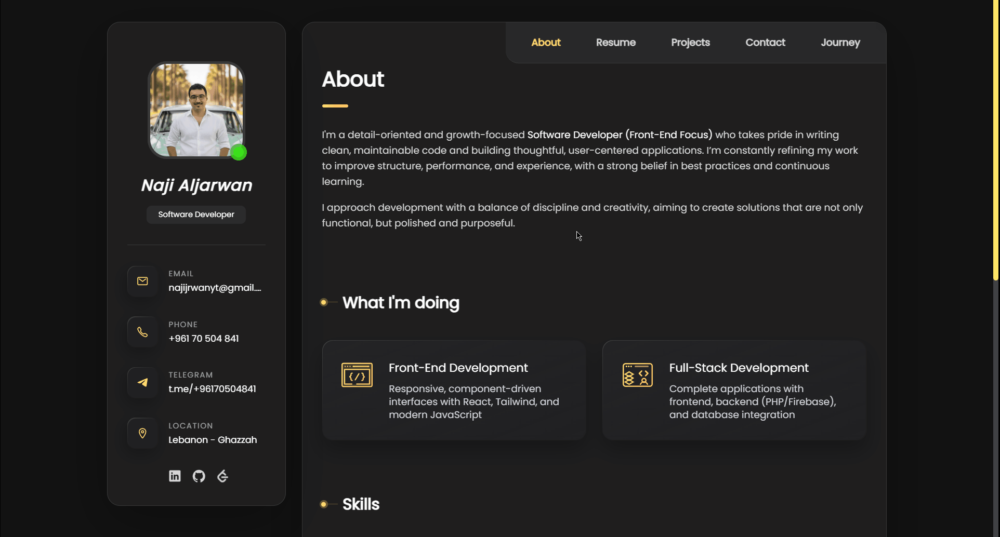
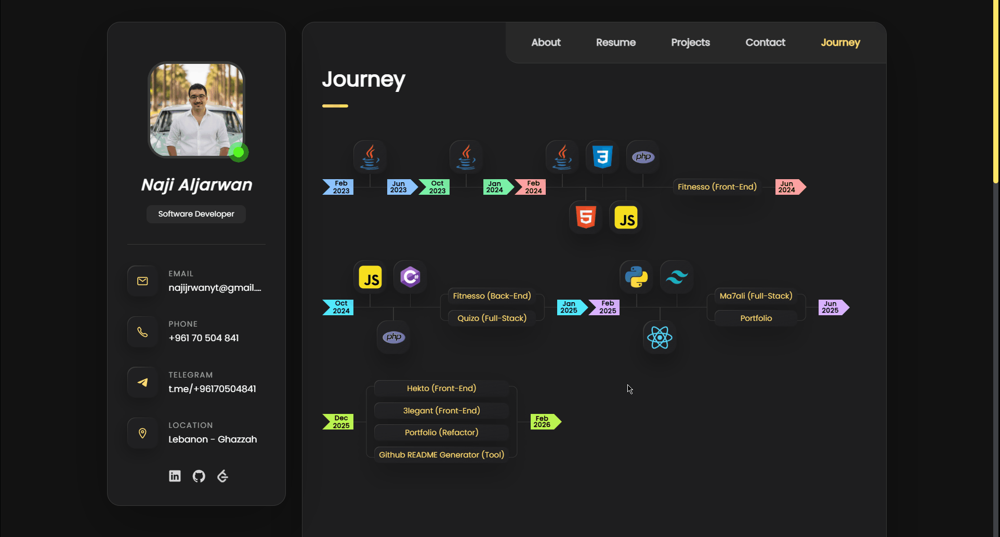
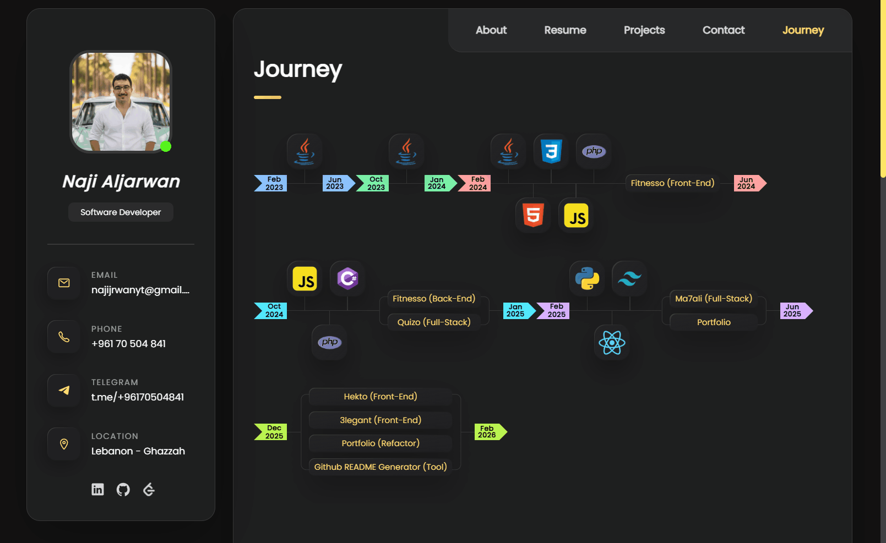

<h1 align="center">
⭐ Portfolio • Modern Responsive Portfolio Showcase
</h1>


> A scalable, component-driven portfolio website showcasing my skills, journey, and projects through a thoughtfully designed, fully responsive interface.


---


## 📸 Showcase

### Overview
<div align="center">
  
</div>

### Live Demo
👉 https://najialjarwan.vercel.app

### Key Interaction
<div align="center">
  
</div>

### Responsive Design
<div align="center">
  
</div>


## 🔷 Project Overview
<table align="center">
<tr><td>Type</td><td>Personal Project</td></tr>
<tr><td>Platform</td><td>Website</td></tr>
<tr><td>Duration</td><td>May 18 - Jun 22</td></tr>
<tr><td>Status</td><td>Completed</td></tr>
<tr><td>Version</td><td>2.0.0</td></tr>
</table>


## ⚙️ Tech Stack & Tools
<table align="center">
  <tr>
    <td>
      <strong>Frontend</strong>
    </td>
    <td>
      <strong>Hosting</strong>
    </td>
    <td>
      <strong>Tools</strong>
    </td>
  </tr>
  <tr>
    <td>
      
      
      
      
      
    </td>
    <td>
      &nbsp;&nbsp;
    </td>
    <td>
      
      
      
    </td>
  </tr>
</table>


## 🗂️ Project Structure

```bash
├── index.html              # Entry HTML
├── package.json
├── vite.config.js
├── vercel.json.local
├── public/                 # Static file
│   ├── demo                # Showcase GIFs
│   ├── external-icons/     # Technology & social icons
│   ├── images/             # Portfolio, projects, skills images
│   ├── pdfs/               # Resume & reports
│   └── webmanifest/        # PWA manifest & favicons
├── api/                    # Serverless functions
│   └── contact.js
├── src/
│   ├── App.jsx             # Main React App
│   ├── main.jsx            # Entry point
│   ├── components/         # Reusable UI components
│   │   ├── layout/         # Hero, Navbar, general layout
│   │   ├── sections/       # About, Projects, Resume, Journey, Contact
│   │   └── ui/             # Buttons, icons, skill visuals
│   ├── data/               # Static data & constants
│   ├── hooks/              # Custom hooks
│   ├── pages/              # Application pages
│   ├── index.css
│   └── utils/              # Helper functions
```


## 💡 Problem / Motivation

This portfolio was created to present my development journey through a structured, maintainable system rather than a static showcase website. Over time it has been refactored to adopt a data-driven architecture where projects, skills, and experience are rendered dynamically from centralized configuration files, allowing the site to grow alongside my work.


## ✨ Key Features

- Centralized project and skills configuration enabling scalable data-driven content
- Modular React architecture with reusable UI components
- Dynamic rendering of projects, resume highlights, and development journey
- Structured portfolio sections designed for clarity and easy navigation
- Responsive interface optimized across desktop and mobile devices
- Clean and maintainable frontend architecture focused on long-term scalability


## 🚀 Future Improvements

- Add multilingual support for wider audience reach.
- Integrate more visualizations for dynamic journey tracking.
- Implement dark mode toggle and additional accessibility options.
- Enhance journey page animations and interactive visual storytelling.


## 🎨 Credits & Inspirations

- Design inspired by open-source GitHub portfolio templates
- Solely developed front-end and dynamic data-driven rendering


## 📝 Notes

- The architecture prioritizes long-term scalability. Most site content is controlled through structured data, allowing new sections, projects, or visual components to be integrated with minimal code changes.


---


<p align="center">
  <em>This README was automatically generated using a custom README generator</em> ✨
</p>
